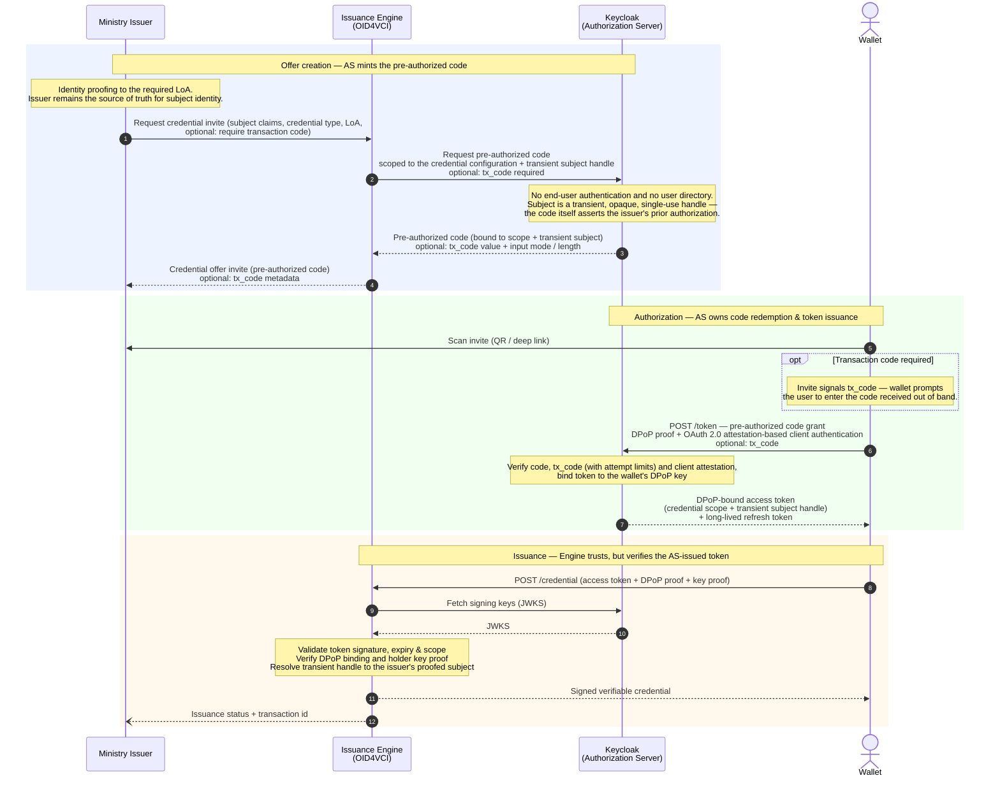

# Pre-Authorized Code Flow — Keycloak as Authorization Server

```mermaid
sequenceDiagram
 autonumber
 participant MI as Ministry Issuer
 participant IE as Issuance Engine<br/>(OID4VCI)
 participant AS as Keycloak<br/>(Authorization Server)
 actor W as Wallet

 rect rgb(238,244,255)
 Note over MI,AS: Offer creation — AS mints the pre-authorized code
 Note over MI: Identity proofing to the required LoA.<br/>Issuer remains the source of truth for subject identity.
 MI->>IE: Request credential invite (subject claims, credential type, LoA,<br/>optional: require transaction code)
 IE->>AS: Request pre-authorized code<br/>scoped to the credential configuration + transient subject handle<br/>optional: tx_code required
 Note over AS: No end-user authentication and no user directory.<br/>Subject is a transient, opaque, single-use handle —<br/>the code itself asserts the issuer's prior authorization.
 AS-->>IE: Pre-authorized code (bound to scope + transient subject)<br/>optional: tx_code value + input mode / length
 IE-->>MI: Credential offer invite (pre-authorized code)<br/>optional: tx_code metadata
 end

 rect rgb(240,255,240)
 Note over W,AS: Authorization — AS owns code redemption & token issuance
 W->>MI: Scan invite (QR / deep link)
 opt Transaction code required
 Note over W: Invite signals tx_code — wallet prompts<br/>the user to enter the code received out of band.
 end
 W->>AS: POST /token — pre-authorized code grant<br/>DPoP proof + OAuth 2.0 attestation-based client authentication<br/>optional: tx_code
 Note over AS: Verify code, tx_code (with attempt limits) and client attestation,<br/>bind token to the wallet's DPoP key
 AS-->>W: DPoP-bound access token<br/>(credential scope + transient subject handle)<br/>+ long-lived refresh token
 end

 rect rgb(255,248,236)
 Note over W,IE: Issuance — Engine trusts, but verifies the AS-issued token
 W->>IE: POST /credential (access token + DPoP proof + key proof)
 IE->>AS: Fetch signing keys (JWKS)
 AS-->>IE: JWKS
 Note over IE: Validate token signature, expiry & scope<br/>Verify DPoP binding and holder key proof<br/>Resolve transient handle to the issuer's proofed subject
 IE-->>W: Signed verifiable credential
 IE--)MI: Issuance status + transaction id
 end
```
